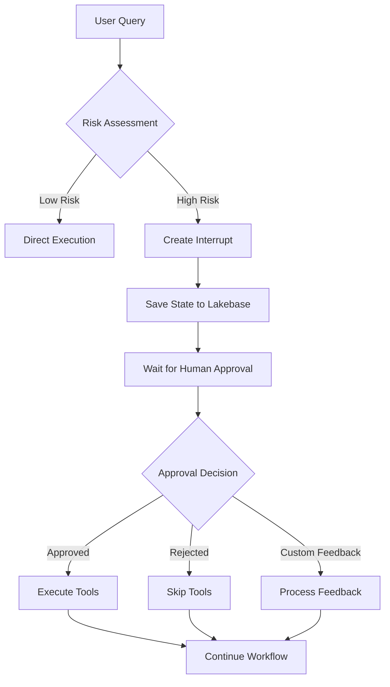

# 🤖 LangGraph Human Interruption Agent

LangGraph agent with human-in-the-loop approval capabilities for Databricks, featuring state persistence, Unity Catalog integration, and interruption workflows.

## ✨ Features

### 🛡️ Human-in-the-Loop Approval System
Interruption mechanism that automatically pauses execution before high-risk operations:
- Pauses workflow at designated interrupt points before tool execution
- Provides detailed information about pending tool calls and arguments
- Waits for explicit approval ("approved", "rejected", or custom feedback)
- Continues seamlessly once approved or handles rejection gracefully
- ***Future ToDo***: use user permissioning and roles to facilitate continuation of threads

### 💾 State Persistence with Lakebase
Built on PostgreSQL checkpointer integration using Databricks Lakebase:
- Conversation state preservation across interruptions and restarts
- Thread-based conversation tracking for multi-session continuity
- Automatic credential management through Databricks workspace client

### 🔧 Unity Catalog Function Integration
Native support for Databricks Unity Catalog functions as callable tools:
- Dynamic UC function discovery and binding (`UCFunctionToolkit`)
- Automatic permission management for service principal access

## 🚀 Quick Start

### 1. Clone Repository to Databricks
```bash
# In Databricks workspace, navigate to Repos
# Click "Add Repo" and clone:
https://github.com/your-org/dbx-agent-human-interruption.git
```

### 2. Install Dependencies
```python
%pip install -r requirements.txt
dbutils.library.restartPython()
```

### 3. Configure Environment
```python
# Set up configuration widgets
dbutils.widgets.text("lakebase_instance", "agent-human-interaction", "Lakebase Instance")
dbutils.widgets.text("db_client_id", "<service-principal-uuid>", "Client ID")
dbutils.widgets.text("db_client_secret", "<secret>", "Client Secret")
dbutils.widgets.text("endpoint_name", "databricks-meta-llama-3-3-70b-instruct", "Model Endpoint")

# Set environment variables
import os
os.environ["ENDPOINT_NAME"] = dbutils.widgets.get("endpoint_name")
os.environ["LAKEBASE_INSTANCE"] = dbutils.widgets.get("lakebase_instance")
os.environ["DATABRICKS_CLIENT_ID"] = dbutils.widgets.get("db_client_id")
os.environ["DATABRICKS_CLIENT_SECRET"] = dbutils.widgets.get("db_client_secret")
```

### 4. Initialize Database
```python
from src.lakebase.database import LakebaseDatabase
from langgraph.checkpoint.postgres import PostgresSaver

# Initialize Lakebase connection
lb = LakebaseDatabase(host=os.getenv("DATABRICKS_HOST"))
conn_string = lb.initialize_connection(
    user=os.getenv("DATABRICKS_CLIENT_ID"),
    instance_name=os.getenv("LAKEBASE_INSTANCE")
)

# Setup checkpointer tables
with PostgresSaver.from_conn_string(conn_string) as checkpointer:
    checkpointer.setup()
```

### 5. Initialize Agent
```python
from src.agents.human_interruption_agent import AGENT

# The agent is automatically configured from environment variables
response = AGENT.predict({
    "messages": [{"role": "user", "content": "Hello! What can you do?"}]
})
print(response.messages[-1].content)
```

## 📋 Requirements

### Unity Catalog (UC)
- Unity Catalog enabled workspace
- Catalog and schema for model registration
- Service principal with permissions:
  ```sql
  GRANT USE CATALOG ON CATALOG catalog_name TO `service_principal_id`;
  GRANT USE SCHEMA ON SCHEMA catalog_name.schema_name TO `service_principal_id`;
  GRANT CREATE MODEL ON SCHEMA catalog_name.schema_name TO `service_principal_id`;
  GRANT EXECUTE ON FUNCTION catalog_name.schema_name.function_name TO `service_principal_id`;
  ```

### Databricks Managed Identity
- Service principal with client ID and secret
- Database role assignment in Lakebase
- Required environment variables:
  ```bash
  DATABRICKS_CLIENT_ID=<uuid>
  DATABRICKS_CLIENT_SECRET=<secret>
  DATABRICKS_HOST=<workspace-url>
  ```

### Lakebase (PostgreSQL)
- Lakebase instance created with Databricks Managed Identity integration
- Database: `databricks_postgres` with SSL required
- PostgresSaver checkpoint tables for state persistence

### Model Serving Endpoint
- Databricks Foundation Model endpoint (e.g., `databricks-meta-llama-3-3-70b-instruct`)
- Or custom model serving endpoint

## 🗂️ Project Structure

```
dbx-agent-human-interruption/
├── src/
│   ├── agents/
│   │   └── human_interruption_agent.py   # Main agent implementation
│   └── lakebase/
│       └── database.py                    # Lakebase connection manager
├── notebook/
│   └── e2e-human-interruption-agent.ipynb # Complete example notebook
├── requirements.txt                       # Python dependencies
└── databricks.yml                         # Databricks configuration
```

## 💻 Python Examples

### Basic Prediction
```python
# Simple question-answer
response = AGENT.predict({
    "messages": [{"role": "user", "content": "What capabilities do you have?"}]
})
print(response.messages[-1].content)
thread_id = response.custom_outputs.get('thread_id')
```

### Using State (Continuing Conversation)
```python
# Continue previous conversation using thread_id
followup = AGENT.predict(
    messages=[{"role": "user", "content": "What was my previous question?"}],
    custom_inputs={"thread_id": thread_id}  # Pass thread_id to continue
)
print(followup.messages[-1].content)
```

### Handling Interruptions
```python
# Request that triggers tool use - will interrupt for approval
tool_response = AGENT.predict(
    messages=[{"role": "user", "content": "Get top usage data for 2025-09-17"}],
    custom_inputs={"thread_id": thread_id}
)

# Check if interrupted
if tool_response.custom_outputs.get('is_interrupted'):
    print("⚠️ Tool approval required!")
    print("Pending tools:", tool_response.custom_outputs.get('pending_tool_calls'))
    print(tool_response.messages[-1].content)  # Shows approval request message
```

### Continuing After Approval
```python
# Approve and continue
resume_response = AGENT.resume(
    command_value="approved",  # Options: "approved", "rejected", or custom feedback
    thread_id=thread_id
)
print(resume_response.messages[-1].content)

# Or reject the tool execution
reject_response = AGENT.resume(
    command_value="rejected",
    thread_id=thread_id
)
```

### Streaming Responses
```python
# Get real-time streaming responses
for chunk in AGENT.predict_stream(
    messages=[{"role": "user", "content": "Explain quantum computing"}],
    custom_inputs={"thread_id": thread_id}
):
    if chunk.delta.get('content'):
        print(chunk.delta['content'], end='')
```

## 🔄 Interruption Workflow



## 📚 Additional Resources

- [Complete Example Notebook](notebook/e2e-human-interruption-agent.ipynb)
- [LangGraph Documentation](https://langchain-ai.github.io/langgraph/)
- [Databricks MLflow Integration](https://docs.databricks.com/mlflow/)
- [Unity Catalog Functions](https://docs.databricks.com/sql/language-manual/sql-ref-functions.html)
